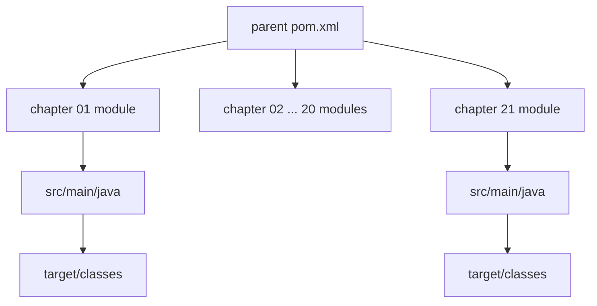

# Maven 多模块架构

```mermaid
flowchart TD
    P["parent pom.xml"] --> M1["chapter 01 module"]
    P --> M2["chapter 02 ... 20 modules"]
    P --> M21["chapter 21 module"]
    M1 --> S1["src/main/java"]
    M21 --> S21["src/main/java"]
    S1 --> T1["target/classes"]
    S21 --> T21["target/classes"]
```

父 POM 只管理 Java 版本、编码、插件版本和 module 列表；章节之间没有编译依赖，保证任意案例都能被单独学习、修改和排错。

第 21 章的内部模式协作详见其 README。它不会依赖前 20 章的教学类，而是以独立领域模型重新组合模式，避免示例之间产生隐式耦合。

