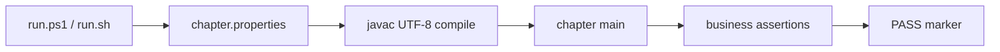
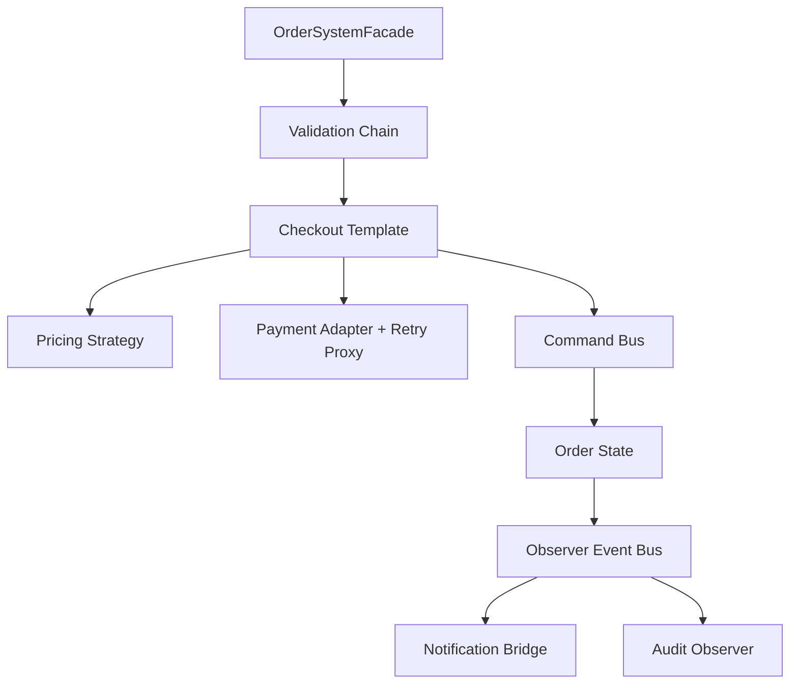

# 架构与模式映射

## 学习代码架构

```mermaid
flowchart LR
    R["run.ps1 / run.sh"] --> P["chapter.properties"]
    P --> C["javac UTF-8 compile"]
    C --> M["chapter main"]
    M --> A["business assertions"]
    A --> O["PASS marker"]
```

每章独立编译，防止一个章节的示例类型污染另一个章节。示例采用“接口/抽象 → 具体实现 → 客户端 → 断言”的固定观察顺序，但业务场景随资料章节变化。

## 综合项目控制流

```mermaid
flowchart TD
    UI["OrderSystemFacade"] --> V["Validation Chain"]
    V --> W["Checkout Template"]
    W --> S["Pricing Strategy"]
    W --> P["Payment Adapter + Retry Proxy"]
    W --> C["Command Bus"]
    C --> ST["Order State"]
    ST --> E["Observer Event Bus"]
    E --> N["Notification Bridge"]
    E --> L["Audit Observer"]
```

综合项目刻意组合模式，但每个模式都有明确变化点：渠道、算法、外部接口、工作流、状态与横切观测。详细角色表在第 21 章 README。

